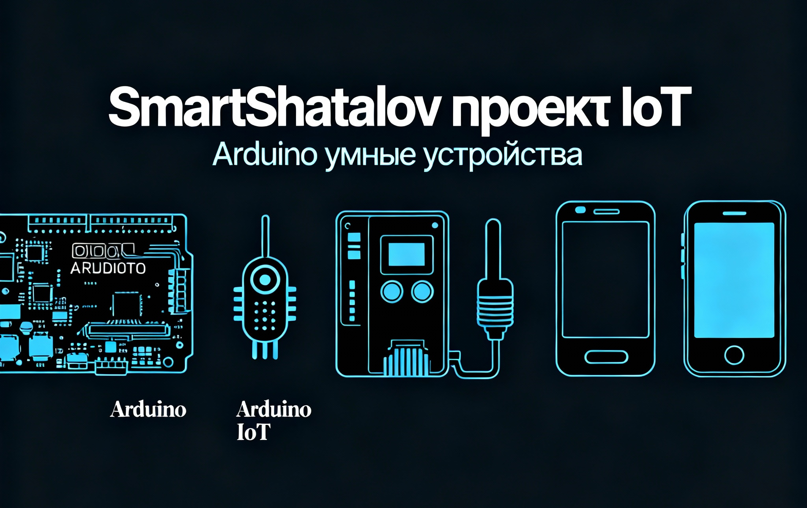

# SmartShatalov

> [!NOTE]
> Небольшой проект по созданию интеллектуальных устройств 
> в области Интернета вещей (IoT) с использованием Arduino.
>
> Проект предназначен для хранения, передачи и формирования полного представления о необходимых и достаточных для сдачи дополнительного задания по предмету "Умные системы интернета вещей"
>

## Содержание

1. [Введение](README.md#введение)
2. [Технологии и материалы для сборки](./README.md#технологии-и-материалы-для-сборки)
   - [Технологии](./README.md#технологии-необходимые-для-разработки)
   - [Используемые электронные материалы](./README.md#используемые-электронные-материалы)
3. [Структура репозитория](./README.md#структура-репозитория)
4. [Полезные материалы и источники](./README.md#полезные-материалы-и-источники)

----

 

## Введение

 

## Технологии и материалы для сборки

### Технологии, необходимые для разработки

### Используемые электронные материалы

 

## Структура репозитория

 

## Полезные материалы и источники

----

  

###### 04.10.2025